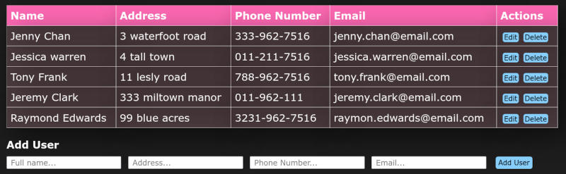

## DESCRIPTION:
- A user data app, made with React.

## OUTCOME:
- a play with tables in React.
### VERSION 1 (branch: main)
- THe original version, followed Chris B's tutorial.
### VERSION 2 (branch: app-1) 
- Re-did it. Because practise makes purrfect.
- Up till ReadOnly.jsx
### VERSION 2 (branch: app-1) 
- Re-did it. Because practise makes purrfect.
- The completed project.

## TECH STACKS:
- React.
- Hooks: useState.
- styling: CSS.

## PROGRESS:
- Done: 100%;

## How to run
`yarn install`
`yarn start`

## View other projects:
- [My Blog](https://hashnode.com/@marizoo)
- [My Pinterest](https://pin.it/16vGwjy)
- [My Youtube Channel](https://www.youtube.com/channel/UCfkbnM9WvHD3mjecBiGHCBQ/playlists)

## IMAGE:

-------